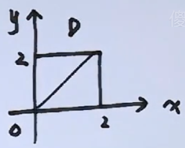
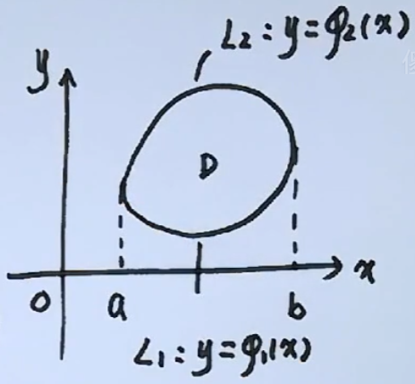
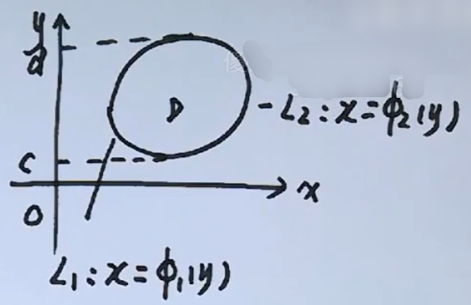
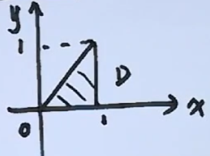
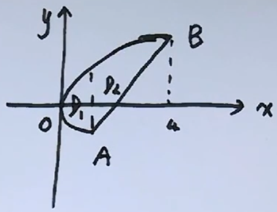
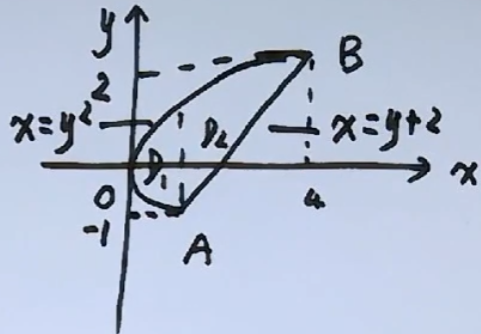
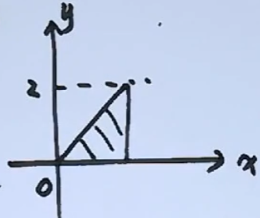
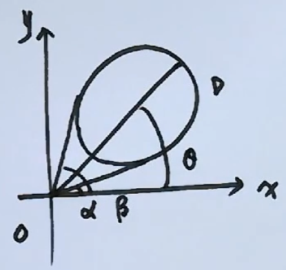
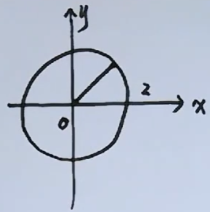
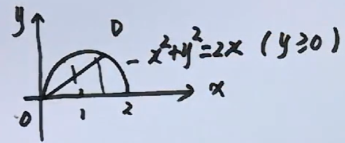

# 二重积分

## 定义

$$
定积分,f(x)在[a,b]上有界
$$

$$
\begin{align}
&1.~a=x_0<x_1<...<x_n=b\\
&2.~\forall\xi_i\in[x_{i-1},x_i],\sum_{i=1}^nf(\xi_i)\Delta x_i\\
&3.~\lambda=\max{\{\Delta x_1,...,\Delta x_n\}}
\end{align}
$$

$$
若\lim_{\lambda\rightarrow 0}\sum_{i=1}^nf(\xi_i)\Delta x_i\exist,称f(x)在[a,b]上可积\\
极限值称为f(x)在[a,b]上的定积分，记作\int_a^bf(x)dx
$$

---

$$
设D为xoy面有界闭区域，f(x,y)在D上有界
$$

$$
\begin{align}
&1.~D分成\Delta\sigma_1,...,\Delta\sigma_n\\
&2.~\forall(\xi_i,\eta_i)\in\Delta\sigma_i,作\sum_{i=1}^nf(\xi_i,\eta_i)\Delta\sigma_i\\
&3.~\lambda为\Delta\sigma_1,...,\Delta\sigma_n直径最大者
\end{align}
$$

$$
若\lim_{\lambda\rightarrow 0}\sum_{i=1}^nf(\xi_i,\eta_i)\Delta\sigma_i\exist,极限值称f(x,y)在D上的二重积分，记作\iint_Df(x,y)d\sigma\\
即\iint_Df(x,y)d\sigma\triangleq \lim_{\lambda\rightarrow 0}\sum_{i=1}^nf(\xi_i,\eta_i)\Delta\sigma_i
$$

## 性质

$$
\begin{align}
&1.~D=D_1+D_2,D_1\cap D_2=\emptyset,\iint_D=\iint_{D_1}+\iint_{D_2}\\
&2.~\iint_D1d\sigma=A\\
&3.~D关于y轴对称，右D_1\\
&~~~~\begin{cases}
f(-x,y)=-f(x,y)\Rightarrow\iint_Df(x,y)d\sigma=0\\
f(-x,y)=f(x,y)\Rightarrow\iint_Df(x,y)d\sigma=2\iint_{D_1}f(x,y)d\sigma
\end{cases}\\
&~~~~~D关于y=x对称，则\\
&~~~~~\iint_Df(x,y)d\sigma=\iint_Df(y,x)d\sigma
\end{align}
$$

---

$$
f(u)>0,\forall a>0,b>0\\
I=\iint_D\frac{af(x)+bf(y)}{f(x)+f(y)}d\sigma=\iint_D\frac{af(y)+bf(x)}{f(y)+f(x)}d\sigma\\
2I=(a+b)\iint_Dd\sigma=4(a+b),I=2(a+b)
$$

## 积分法

### 直角坐标法

$$
\iint_Df(x,y)d\sigma
$$

1. x型区域

   
   $$
   D={(x,y)|a\leq x\leq b,\Phi_1(x)\leq y\leq\Phi_2(x)}
   $$

   $$
   \iint_Df(x,y)d\sigma=\int_a^bdx\int_{\Phi_1(x)}^{\Phi_2(x)}f(x,y)dy
   $$

2. y型区域

   
   $$
   D=\{(x,y)|c\leq x\leq d,\phi_1(y)\leq x\leq\phi_2(y)\}
   $$

   $$
   \iint_Df(x,y)d\sigma=\int_c^ddy\int_{\phi_1(y)}^{\phi_2(y)}f(x,y)dx
   $$

   ---

   $$
   计算\iint_Dx^2ydxdy,其中D由y=x,x=1及x轴所围成
   $$

   
   $$
   D=\{(x,y)|0\leq x\leq 1,0\leq y\leq x\}
   $$

   $$
   \iint_Dx^2yd\sigma=\int_0^1x^2dx\int_{0}^{x}ydy=\frac{1}{2}\int_0^1x^4dx=\frac{1}{10}
   $$

   $$
   D=\{(x,y)|0\leq y\leq 1,y\leq x\leq 1\}
   $$

   $$
   \iint_Dx^2yd\sigma=\int_0^1ydy\int_{y}^{1}x^2dx=\frac{1}{3}\int_0^1(y-y^4)dy=\frac{1}{10}
   $$

   ---

   $$
   计算I=\iint_Dxdxdy,其中D由x=y^2与y=x-2围成
   $$

   
   $$
   由\begin{cases}
   x=y^2\\
   y=x-2
   \end{cases}\Rightarrow
   A(1,-1),B(4,2)
   $$

   $$
   D_1=\{(x,y)|0\leq x\leq 1,-\sqrt{x}\leq y\leq \sqrt{x}\}\\
   D_2=\{(x,y)|1\leq x\leq 4,x-2\leq y\leq \sqrt{x}\}\\
   $$

   $$
   \begin{align}
   原式=&\int_0^1xdx\int_{-\sqrt{x}}^\sqrt{x}1dy+\int_1^4xdx\int_{x-2}^\sqrt{x}1dy\\
   =&2\int_0^1x^{\frac{3}{2}}dx+\int_1^4(x^\frac{3}{2}+x^2-2x)dx
   \end{align}
   $$

   
   $$
   D=\{(x,y)|y^2\leq x\leq y+2,-1\leq y\leq 2\}\\
   原式=\int_{-1}^2dy\int_{y^2}^{y+2}xdx
   $$

   ---

   $$
   x^{2n}e^{\pm x^2}dx\\
   e^{\frac{k}{x}}dx\\
   \cos\frac{k}{x}dx,\sin\frac{k}{x}dx
   $$

   ---

   $$
   计算I=\int_0^2dy\int_y^2e^{-x^2}dx
   $$

   
   $$
   \begin{align}
   I&=\int_0^2dy\int_y^2e^{-x^2}dx\\
   &=\int_0^2xe^{-x^2}dx\\
   &=-\frac{1}{2}e^{-x^2}\mid_0^2\\
   &=-\frac{1}{2}(\frac{1}{e^4}-1)
   \end{align}
   $$

### 极坐标法

特征
$$
\begin{align}
&1.~D边界区域含x^2+y^2\\
&2.~f(x,y)中含x^2+y^2\\
\end{align}
$$
变换

$$
\begin{cases}
x=r\cos\theta\\
y=r\sin\theta
\end{cases}
$$

$$
\alpha\leq\theta\leq\beta,r_1(\theta)\leq r\leq r_2(\theta)
$$

面积
$$
d\sigma=rdrd\theta
$$

---

$$
计算I=\iint_D(x^2+3xy)d\sigma,其中圆域x^2+y^2\leq4
$$

$$
I=\iint_D(x^2+3xy)d\sigma=\iint_Dx^2d\sigma=\iint_Dy^2d\sigma=\frac{1}{2}\iint_D(x^2+y^2)d\sigma
$$

$$
令\begin{cases}
x=r\cos\theta\\
y=r\sin\theta
\end{cases}(0\leq\theta\leq2\pi,0\leq r\leq 2)
$$

$$
I=\frac{1}{2}\int_0^{2\pi}d\theta\int_0^2r^3dr=4\pi
$$

---

$$
I=\iint_Dx^2d\sigma,D由y=\sqrt{2x-x^2}与x轴围成
$$

$$
令\begin{cases}
x=r\cos\theta\\
y=r\sin\theta
\end{cases}(0\leq\theta\leq\frac{\pi}{2},0\leq r\leq 2\cos\theta)
$$

$$
\begin{align}
I&=\int_0^{\frac{\pi}{2}}d\theta\int_0^{2\cos\theta}r^3\cos^2\theta dr\\
&=\int_0^{\frac{\pi}{2}}\cos^2\theta d\theta\int_0^{2\cos\theta}r^3 dr\\
&=4\int_0^{\frac{\pi}{2}}\cos^6\theta\\
&=4*\frac{5}{6}*\frac{3}{4}*\frac{1}{2}*\frac{\pi}{2}
\end{align}
$$

