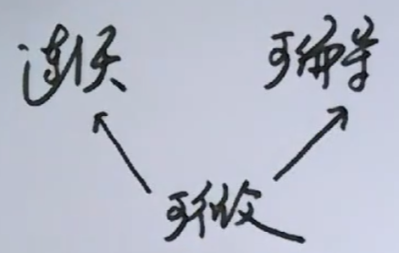
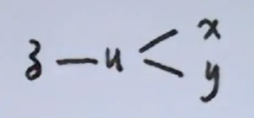

# 多元函数微分学

$$
M_0(x_0,y_0),\delta>0\\
\{(x,y)|\sqrt{(x-x_0)^2+(y-y_0)^2}<\delta\}\\
\{(x,y)|0<\sqrt{(x-x_0)^2+(y-y_0)^2}<\delta\}
$$

## 极限

$$
若\forall\epsilon>0,\exist\delta>0,当0<|x-a|<\delta时,\\
|f(x)-A|<\epsilon\\
\lim_{x\rightarrow a}f(x)=A\\
\lim_{x\rightarrow a}f(x)存在\Longleftrightarrow f(a-0),f(a+0)存在且相等
$$

$$
若\forall\epsilon>0,\exists\delta>0,当0<\sqrt{(x-x_0)^2+(y-y_0)^2}<\delta时,\\
|f(x,y)-A|<\epsilon\\
\lim_{x\rightarrow x_0,y\rightarrow y_0}f(x,y)=A
$$

$$
\lim_{x\rightarrow 0,y\rightarrow 2}\frac{\sqrt{1+xy}-\sqrt{1-xy}}{\sin x}\\
\begin{align}
原式&=\lim_{x\rightarrow 0,y\rightarrow 2}\frac{\sqrt{1+xy}-\sqrt{1-xy}}{xy}y\\
&=2\lim_{t\rightarrow 0}\frac{\sqrt{1+t}-\sqrt{1-t}}{t}\\
&=2\lim_{t\rightarrow 0}\frac{1}{\sqrt{1+t}+\sqrt{1-t}}*2\\
&=2
\end{align}
$$

$$
f(x,y)=
\begin{cases}
\frac{x+y}{|x|+|y|},(x,y)\neq(0,0),\\
0,(x,y)=(0,0),
\end{cases}
~~讨论\lim_{x\rightarrow 0,y\rightarrow 0}f(x,y)是否存在\\
\lim_{x\rightarrow 0,y=0}f(x,y)=\lim_{x\rightarrow 0}\frac{x}{|x|}不存在\Rightarrow \lim_{x\rightarrow 0,y\rightarrow 0}\frac{x+y}{|x|+|y|}不存在
$$

## 连续

$$
f(x)在x=a连续\Leftrightarrow f(a-0)=f(a+0)=f(a)
$$

$$
若\lim_{x\rightarrow x_0,y\rightarrow y_0}f(x,y)=f(x_0,y_0)\\
$$

## 偏导数

$$
y=f(x)(x\in D),a\in D\\
若\lim_{\Delta x\rightarrow 0}\frac{\Delta y}{\Delta x}存在(或\lim_{x\rightarrow a}\frac{f(x)-f(a)}{x-a}存在)，称f(x)在x=a可导\\
f'(a),\frac{dy}{dx}\mid_{x=a}\\
f'(a)存在\Rightarrow f(x)在x=a连续
$$

$$
z=f(x,y)((x,y)\in D),(x_0,y_0)\in D\\
f(x_0+\Delta x,y_0)-f(x_0,y_0)\triangleq\Delta z_x\\
f(x_0,y_0+\Delta y)-f(x_0,y_0)\triangleq\Delta z_y\\
f(x_0+\Delta x,y_0+\Delta y)-f(x_0,y_0)\triangleq\Delta z\\
$$

$$
若\lim_{\Delta x\rightarrow 0}\frac{\Delta z_x}{\Delta x}存在(或\lim_{x\rightarrow x_0}\frac{f(x,y_0)-f(x_0,y_0)}{x-x_0}存在),称f(x,y)在(x_0,y_0)对x可偏导\\
记f_x(x_0,y_0),\frac{\partial z}{\partial x}\mid_{x_0,y_0}
$$

$$
z=x^2e^{\sin y}\\
\frac{\partial z}{\partial x}=2xe^{\sin y},\frac{\partial z}{\partial y}=x^2e^{\sin y}\cos y\\
\frac{\partial^2 z}{\partial x^2}=\frac{\partial}{\partial x}(\frac{\partial z}{\partial x})=2e^{\sin y},\frac{\partial^2 z}{\partial y^2}=\frac{\partial}{\partial y}(\frac{\partial z}{\partial y})=x^2e^{\sin y}\cos^2y-x^2e^{\sin y}\sin y\\
\frac{\partial^2 z}{\partial x\partial y}=\frac{\partial}{\partial y}(\frac{\partial z}{\partial x})=2xe^{\sin y}\cos y,\frac{\partial^2 z}{\partial y\partial x}=\frac{\partial}{\partial x}(\frac{\partial z}{\partial y})=2xe^{\sin y}\cos y
$$

## 连续的性质

$$
f(x)在有界闭区域上，f(x)\in C[a,b]
$$

$$
\begin{align}
&1.~\exist m,M\\
&2.~\exists k>0,|f(x)|\leq k\\
&3.~若f(a)f(b)<0\Rightarrow\exist c\in(a,b),使f(c)=0\\
&4.~\forall\eta\in[m,M],\exists\xi\in[a,b],使f(\xi)=\eta
\end{align}
$$

$$
D-xoy面上有界闭区域,f(x,y)\in C(D)
$$

$$
\begin{align}
&1.~\exist m,M\\
&2.~\exist k>0,使|f(x,y)|\leq k\\
&3.~\forall\delta\in[m,M],\exist(\xi,\eta)\in D,使f(\xi,\eta)=\delta\\
&4.~若z=f(x,y)二阶连续可偏导\Rightarrow\frac{\partial^2 z}{\partial y\partial x}=\frac{\partial^2 z}{\partial x\partial y}
\end{align}
$$

## 全微分

$$
y=f(x)(x\in D),a\in D,\Delta y=f(a+\Delta x)-f(a)(或\Delta y=f(x)-f(a))\\
若\Delta y=A\Delta x+o(\Delta x),称y=f(x)在x=a可微\\
A\Delta x\triangleq \frac{dy}{dx}\mid_{x=a},A\Delta x= A dx
$$

$$
\begin{align}
&1.~f(x)在x=a可导\Leftrightarrow f(x)在x=a可微\\
&2.~若\Delta y=A\Delta x+o(\Delta x),则A=f'(a)\\
&3.~设y=f(x)可导,dy=df(x)=f'(x)dx
\end{align}
$$

$$
z=f(x,y)((x,y)\in D),(x_0,y_0)\in D\\
\Delta z= f(x_0+\Delta x,y_0+\Delta y)-f(x_0,y_0)=f(x,y)-f(x_0,y_0)\\
令\rho=\sqrt{(\Delta x)^2+(\Delta y)^2}\\
若\Delta z=A\Delta x+B\Delta y+o(\rho),称z=f(x,y)在(x_0,y_0)处可全微(可微)\\
A\Delta x+ B\Delta y\triangleq dz\mid_{M_0}=Adx+Bdy
$$

$$
\begin{align}
&1.~若\Delta z=A\Delta x+ B\Delta y +o(\rho)\Rightarrow A=\frac{\partial z}{\partial x}\mid_{M_0},B=\frac{\partial z}{\partial y}\mid_{M_0}\\
&2.~若z=f(x,y)可微,则dz=\frac{\partial z}{\partial x}dx+\frac{\partial z}{\partial y}dy

\end{align}
$$

$$
z=x^2\ln(1+\tan y)\\
\frac{\partial z}{\partial x}=2x\ln(1+\tan y),\frac{\partial z}{\partial y}=\frac{x^2\sec^2y}{1+\tan y}\\
dz= 2x\ln(1+\tan y)dx+\frac{x^2\sec^2y}{1+\tan y}dy
$$

## 连续 可偏导 可微 关系

$$
可微\Rightarrow连续
$$

$$
\Delta z=f(x,y)-f(x_0,y_0)=A(x-x_0)+B(y-y_0)+o(\sqrt{(x-x_0)^2+(y-y_0)^2})\\
\Rightarrow \lim_{x\rightarrow x_0,y\rightarrow y_0}\Delta z=0\Rightarrow\lim_{x\rightarrow x_0,y\rightarrow y_0}f(x,y)=f(x_0,y_0)
$$

$$
可微\Rightarrow可偏导
$$

$$
\Delta z=f(x_0+\Delta x,y_0+\Delta y)-f(x_0,y_0)=A\Delta x+B\Delta y+o(\rho)\\
取\Delta y=0:\Delta z_x=A\Delta x+o(\Delta x)\\
\Rightarrow\frac{\Delta z_x}{\Delta x}=A+\frac{o(\Delta x)}{\Delta x}\Rightarrow\lim_{\Delta x\rightarrow 0}\frac{\Delta z_x}{\Delta x}=A,且\frac{\partial z}{\partial x}\mid_{M_0}=A\\
同理\frac{\partial z}{\partial x}\mid_{M_0}=B
$$

$$
连续\nRightarrow 可偏导
$$

$$
z=f(x,y)=|x|+|y|\\
\lim_{x\rightarrow 0,y\rightarrow 0}f(x,y)=0=f(0,0)\\
\lim_{x\rightarrow 0}\frac{f(x,0)-f(0,0)}{x-0}=\lim_{x\rightarrow 0}\frac{|x|}{x}不存在\\
\Rightarrow f(x,y)在(0,0)对x不可偏导
$$

$$
可偏导\nRightarrow 连续
$$

$$
z=f(x,y)=
\begin{cases}
\frac{xy}{x^2+y^2},(x,y)\neq(0,0)\\
0,(x,y)=(0,0)
\end{cases}\\
\lim_{x\rightarrow 0}\frac{f(x,0)-f(0,0)}{x}=\lim_{x\rightarrow 0}\frac{0}{x^3}=0\Rightarrow f_x(0,0)=0\\
同理f_y(0,0)=0\\
\lim_{x\rightarrow 0,y=x}f(x,y)=\frac{1}{2}\neq\lim_{x\rightarrow 0,y=-x}f(x,y)=-\frac{1}{2}\\
\Rightarrow\lim_{x\rightarrow 0,y\rightarrow 0}f(x,y)不存在,而f(0,0)=0\\
\therefore f(x,y)在(0,0)不连续
$$

## 显函数求偏导

$$
z=\arctan\frac{x+y}{1-xy}\\
\frac{\partial z}{\partial x}=\frac{1}{1+(\frac{x+y}{1-xy})^2}\frac{(1-xy)-(x+y)(-y)}{(1-xy)^2}
$$

## 复合函数求偏导

$$
\begin{align}
&1.~z=f(x^2+y^2):z=f(u),u=x^2+y^2\\
&2.~z=f(t^2,\sin t):z=f(u,v),
\begin{cases}
u=t^2\\
v=\sin t
\end{cases}\\
&3.~z=f(x^2+y^2,xy):z=f(u,v),
\begin{cases}
u=x^2+y^2\\
v=xy
\end{cases}
\end{align}
$$

$$
z=f(x^2\sin y),求\frac{\partial^2 z}{\partial x\partial y}\\
\frac{\partial z}{\partial x}=f'(x^2\sin y)2x\sin y\\
\frac{\partial^2 z}{\partial x\partial y}=f''(x^2\sin y)x^2\cos y2x\sin y+f'(x^2\sin y)2x\cos y
$$

$$
z=f(t^2,\sin t),求\frac{dz}{dt}\\
\frac{dz}{dt}=2tf_1+\cos tf_2\\
\frac{d^2z}{dt^2}=2f_1+2t(2tf_{11}+\cos tf_{12})-\sin tf_2+\cos t(2tf_{21}+\cos tf_{22})=2f_1-\sin tf_2+4t^2f_{11}+4t\cos tf_{12}+\cos^2tf_{22}\\
$$

$$
z=f(x+y,xy),求\frac{\partial^2z}{\partial x\partial y}\\
\frac{\partial z}{\partial x}=f_1+yf_2\\
\frac{\partial^2 z}{\partial x\partial y}=f_{11}+xf_{12}+f_2+y(f_{21}+xf_{22})=f_{11}+(x+y)f_{12}+f_2+xyf_{22}
$$

## 隐函数(组)求偏导

$$
\begin{align}
&1.~F(x,y)=0\Rightarrow y=\Phi(x)\\
&2.~F(x,y,z)=0\Rightarrow z=\Phi(x,y)\\
&3.~\begin{cases}
F(x,y,z)=0\\
G(x,y,z)=0
\end{cases}
\Rightarrow
\begin{cases}
y=y(x)\\
z=z(x)
\end{cases}
\end{align}
$$

$$
\tan(x+y+z)=x^2+y^2+z,z=z(x,y),求\frac{\partial z}{\partial x}\\
\sec^2(x+y+z)(1+\frac{\partial z}{\partial x})=2x+\frac{\partial z}{\partial x}\Rightarrow \frac{\partial z}{\partial x}=\frac{2x-\sec^2(x+y+z)}{\tan^2(x+y+z)}
$$

$$
\begin{cases}
x-y+2z=1\\
x^2+y^2+4z^2=4
\end{cases}
~,求\frac{dz}{dx}
$$

$$
\begin{cases}
x-y+2z=1\\
x^2+y^2+4z^2=4
\end{cases}\Rightarrow
\begin{cases}
y=y(x)\\
z=z(x)
\end{cases}
$$

$$
\begin{cases}
1-\frac{dy}{dx}+2\frac{dz}{dx}=0\\
2x+2y\frac{dy}{dx}+8z\frac{dz}{dx}=0
\end{cases}
$$

$$
\begin{cases}
xu+yv=1\\
xv-y^2u=e^{x+y}
\end{cases},u=u(x,y),v=v(x,y),求\frac{\partial u}{\partial x},\frac{\partial v}{\partial y}
$$

$$
\begin{cases}
xu+yv=1\\
xv-y^2u=e^{x+y}
\end{cases}\Rightarrow
\begin{cases}
u=u(x,y)\\
v=v(x,y)
\end{cases}
$$

$$
\begin{cases}
u+x\frac{\partial u}{\partial x}+y\frac{\partial v}{\partial x}=0\\
v+x\frac{\partial v}{\partial x}-y^2\frac{\partial u}{\partial x}=e^{x+y}
\end{cases}\Rightarrow
\begin{cases}
\frac{\partial u}{\partial x}\\
\frac{\partial v}{\partial x}
\end{cases}
$$

$$
\begin{cases}
x\frac{\partial u}{\partial y}+v+y\frac{\partial v}{\partial y}=0\\
x\frac{\partial v}{\partial y}-2yu-y^2\frac{\partial u}{\partial y}=e^{x+y}
\end{cases}\Rightarrow
\begin{cases}
\frac{\partial u}{\partial y}\\
\frac{\partial v}{\partial y}
\end{cases}
$$

## 多元函数极值

$$
y=f(x)
$$

$$
\begin{align}
&1.~x\in D\\
&2.~f'(x)
\begin{cases}
=0\\
不存在
\end{cases}\\
&3.~判别法\\
&Th1.\begin{cases}
x<x_0:f'<0\\
x>x_0:f'>0
\end{cases}~,极小值
\\
&~~~~~~~~\begin{cases}
x<x_0:f'>0\\
x>x_0:f'<0
\end{cases}~,极大值\\
&Th2.
f'(x_0)=0,f''(x_0)
\begin{cases}
<0,极大值\\
>0,极小值
\end{cases}
\end{align}
$$

$$
z=f(x,y)((x,y)\in D),(x_0,y_0)\in D
$$

$$
若\exist\delta>0,当0<\sqrt{(x-x_0)^2+(y-y_0)^2}<\delta时\\
f(x,y)<f(x_0,y_0)\\
(x_0,y_0)为极大点,f(x_0,y_0)为极大值
$$

### 无条件极值

$$
z=f(x,y),(x,y)\in D(开区域)
$$

$$
\begin{align}
&1.~\begin{cases}
\frac{\partial z}{\partial x}=0\\
\frac{\partial z}{\partial y}=0
\end{cases}\Rightarrow
\begin{cases}
x\\
y
\end{cases}\\
&2.~设(x,y)=(x_0,y_0)\\
&~~~~A=\frac{\partial^2z}{\partial x^2}\mid_{(x_0,y_0)},B=\frac{\partial^2z}{\partial x\partial y}\mid_{(x_0,y_0)},C=\frac{\partial^2z}{\partial y^2}\mid_{(x_0,y_0)}\\
&3.~AC-B^2\begin{cases}
<0, ×\\
>0, √\begin{cases}
A>0,极小值\\
A<0,极大值
\end{cases}
\end{cases}

\end{align}
$$

$$
求z=f(x,y)=x^3-3x+y^2+2y+2的极值点和极值
$$

$$
\begin{align}
&1.~\begin{cases}
\frac{\partial z}{\partial x}=3x^2-3=0\\
\frac{\partial z}{\partial y}=2y+2=0
\end{cases}\Rightarrow
\begin{cases}
x=-1\\
y=-1
\end{cases},
\begin{cases}
x=1\\
y=-1
\end{cases}\\
&2.~设(x,y)=(x_0,y_0)\\
&~~~~A=\frac{\partial^2z}{\partial x^2}\mid_{(x_0,y_0)}=6x_0,B=\frac{\partial^2z}{\partial x\partial y}\mid_{(x_0,y_0)}=0,C=\frac{\partial^2z}{\partial y^2}\mid_{(x_0,y_0)}=2\\
&3.~(x_0,y_0)=(-1,-1),\\
&~~~~AC-B^2<0\Rightarrow(-1,-1)不是极值点\\
&~~~~(x_0,y_0)=(1,-1),\\
&~~~~AC-B^2>0且A>0\Rightarrow(1,-1)是极小点\\
\end{align}
$$

### 条件极值

$$
如z=f(x,y),s.t.\Phi(x,y)=0
$$

$$
\begin{align}
&1.~F=f(x,y)+\lambda\Phi(x,y)\\
&2.~
\begin{cases}
F_x=f_x+\lambda\Phi_x=0\\
F_y=f_y+\lambda\Phi_y=0\\
F_\lambda=\Phi(x,y)
\end{cases}\Rightarrow
\begin{cases}
x\\
y
\end{cases}
\end{align}
$$

