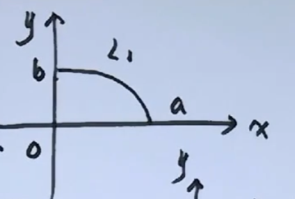

# 定积分的几何应用

## 面积

$$
取[x,x+dx]\sub[a,b]\\
dA=f(x)dx\\
A=\int_a^bf(x)dx
$$

$$
取[\theta,\theta+d\theta]\sub[\alpha,\beta]\\
dA=\frac{1}{2}r^2(\theta)d\theta\\
A=\frac{1}{2}\int_\alpha^\beta r^2(\theta)d\theta
$$

$$
求L:(x^2+y^2)^2=4(x^2-y^2)围成面积\\
\begin{cases}
x=r\cos\theta\\
y=r\sin\theta
\end{cases}
,L:r^2=4\cos{2\theta}\\
A_1=\frac{1}{2}\int_0^\frac{\pi}{4}4\cos{2\theta}d\theta=\int_0^\frac{\pi}{4}\cos{2\theta}d(2\theta)=\int_0^{\frac{\pi}{4}}\cos2\theta d(2\theta)=\int_0^{\frac{\pi}{2}}\cos\theta d\theta\\
\Rightarrow A=4A_1=4
$$

$$
求椭圆L:\frac{x^2}{a^2}+\frac{y^2}{b^2}=1(a>0,b>0)所围成的区域面积\\
L_1:y=\frac{b}{a}\sqrt{a^2-x^2}(0\leq x\leq a)\\
A_1=\frac{b}{a}\int_0^a\sqrt{a^2-x^2}dx=\frac{b}{a}*\frac{\pi}{4}a^2=\frac{\pi}{4}ab\\
A=4A_1=\pi ab
$$

$$
令
\begin{cases}
x=r\cos\theta\\
y=r\sin\theta
\end{cases},L:r^2=\frac{a^2b^2}{b^2\cos^2\theta+a^2\sin^2\theta}\\
A_1=\frac{a^2b^2}{2}\int_0^{\frac{\pi}{2}}\frac{d\theta}{b^2\cos^2\theta+a^2\sin^2\theta}=\frac{ab^2}{2}\int_0^{\frac{\pi}{2}}\frac{d(a\tan\theta)}{b^2+(a\tan\theta)^2}=\frac{ab^2}{2}*\frac{1}{b}\arctan\frac{a\tan\theta}{b}\mid_0^\frac{\pi}{2}=\frac{ab}{2}*\frac{\pi}{2}=\frac{\pi ab}{4}\\
A=4A_1=\pi ab
$$

## 体积

$$
取[x,x+dx]\sub[a,b]\\
dV=\pi f^2(x)dx\\
V_x=\pi\int_a^bf^2(x)dx
$$

$$
取[x,x+dx]\sub[a,b]\\
dV=2\pi xf(x)dx\\
V_y=2\pi\int_a^bxf(x)dx
$$

$$
V_x=\pi\int_0^2f^2(x)dx=\pi\int_0^2y^2dx=\pi\int_0^2(2x-x^2)dx=\pi(4-\frac{8}{3})=\frac{4}{3}\pi\\
取[x+dx]\sub[0,2]\\
dV=2\pi x\sqrt{2x-x^2}dx\\
V_y=2\pi\int_0^2x\sqrt{2x-x^2}dx=2\pi\int_0^2[1+(x-1)]\sqrt{1-(x-1)^2}d(x-1)=2\pi\int_{-1}^1(1+x)\sqrt{1-x^2}dx=2\pi\int_{-1}^1\sqrt{1-x^2}dx=\pi^2
$$
